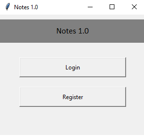
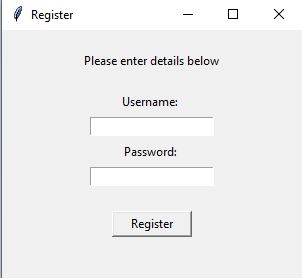
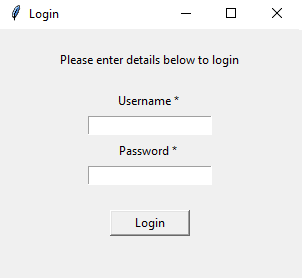
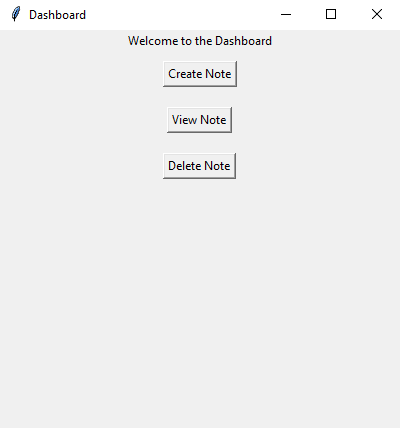
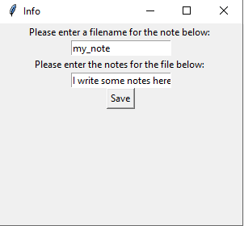
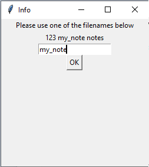

# Egyszerű beléptető rendszer felület, felhasználónként jegyzetek készítése funkcióval  (Login System)
## Bevezetés

A program célja az, hogy kezelni tudja a felhasználókat, mindenki csak a saját jegyzeteihez férjen hozzá, a jelszavakat pedig hashelés után tároljuk, hogy ne lehesen kiolvasni.

A következő funkciókat valósítottuk meg:

* Regisztráció
* Belépés
* Jegyzetek létrehozása
* Jegyzetek megtekintése
* Jegyzetek törlése

A projekt egy .py file-t tartalmaz.

használt könyvtárak: 

 * tkinter
 * os
 * hashlib

## A program felépítése

Induláskor létrehozunk 2 mappát, ha nincsenek még létrehozva a 'users' és a 'notes' mappát. Ezután feljön a kezdőképernyő, ahol 2 lehetőségünk van belépni vagy regisztrálni. 




```python

    def main_screen():
        try:
            os.mkdir('users')
        except FileExistsError:
            pass

        try:
            os.mkdir('notes')
        except FileExistsError:
            pass

        global screen
        screen = Tk()
        screen.geometry("300x250")
        screen.title("Notes 1.0")
        Label(text = "Notes 1.0", bg = "grey", width = "300", height = "2", font = ("Calibri", 13)).pack(pady = 10)
        Button(text = "Login", height = "2", width = "30", command = login).pack(pady = 20)
        Button(text = "Register", height = "2", width = "30", command = register).pack()

        screen.mainloop()
```

Regisztráció esetén kimenti a felhasználónevet és a hashelt jelszót egy fileba a 'users' mappába, később ezek között fogja keresni a felhasználónevet és a jelszavat. 




```python
    def register():
        global screen1
        screen1 = Toplevel(screen)
        screen1.title("Register")
        screen1.geometry("300x250")

        global username
        global password
        global username_entry
        global password_entry
        username = StringVar()
        password = StringVar()

        Label(screen1, text = "Please enter details below").pack(pady = 20)
        Label(screen1, text = "Username: ").pack()
        username_entry = Entry(screen1, textvariable = username)
        username_entry.pack(pady = 5)
        Label(screen1, text = "Password: ").pack()
        password_entry = Entry(screen1, show = "*", textvariable = password)
        password_entry.pack(pady = 5)
        button1 = Button(screen1, text = "Register", width = 10, height = 1)
        button1.pack(pady = 20)
        button1.bind("<Button-1>", register_user)
        screen1.bind("<Return>", register_user)
 ```  
 
 Belépéskor a regisztrált felhasználók közül keresi, hogy létezik-e a felhasználó, ha nem akkor azt írja ki, ha létezik a felhasználó, akkor ellenőrzi, hogy jó-e a jelszó. Mivel hashelve van tárolva a jelszó, neki is hashelni kell, amit beírunk ide.
 
 
 
 
 ```python
   def login():
        global screen2
        screen2 = Toplevel(screen)
        screen2.title("Login")
        screen2.geometry("300x250")
        Label(screen2, text = "Please enter details below to login").pack(pady = 20)

        global username_verify
        global password_verify

        username_verify = StringVar()
        password_verify = StringVar()

        global username_entry1
        global password_entry1

        Label(screen2, text = "Username * ").pack()
        username_entry1 = Entry(screen2, textvariable = username_verify)
        username_entry1.pack(pady = 5)
        Label(screen2, text = "Password * ").pack()
        password_entry1 = Entry(screen2, show = "*", textvariable = password_verify)
        password_entry1.pack(pady = 5)
        button1 = Button(screen2, text = "Login", width = 10, height = 1)
        button1.pack(pady = 20)
        button1.bind("<Button-1>", login_verify)
        screen2.bind("<Return>", login_verify)
  ```

Sikeres belépés után nyitottunk a Session-t. Itt 3 menü érhető el, a Create Note, a View Note és a Delete Note.




   ```python
   def session():
        screen8 = Toplevel(screen)
        screen8.title("Dashboard")
        screen8.geometry("400x400")
        Label(screen8, text = "Welcome to the Dashboard").pack()
        Button(screen8, text = "Create Note", command = create_notes).pack(pady = 10)
        Button(screen8, text = "View Note", command = view_notes).pack(pady = 10)
        Button(screen8, text = "Delete Note", command = delete_note).pack(pady = 10)
   ```
Create Note esetén beírhatunk egy file-nevet, amit létrehozz 'felhasználónév'-'fájlnév' formában. Minden alkalommal hozzáfüzhetünk a már létező jegyzetünkhöz új sorokat, ami addig növekszik, míg nem töröljük az egész file-t.   
   
   
   
   
   ```python 
       def create_notes():
            global raw_filename
            raw_filename = StringVar()
            global raw_notes
            raw_notes = StringVar()

            screen9 = Toplevel(screen)
            screen9.title("Info")
            screen9.geometry("300x250")
            Label(screen9, text = "Please enter a filename for the note below: ").pack()
            Entry(screen9, textvariable = raw_filename).pack()
            Label(screen9, text = "Please enter the notes for the file below: ").pack()
            entry1 = Entry(screen9, textvariable = raw_notes)
            entry1.pack()
            button = Button(screen9, text = "Save")
            button.pack()
            button.bind('<Button-1>', save)
            screen9.bind('<Return>', save)
   ```

View Note esetén kilistázza a felhasználónkhoz kapcsolodó fileokat, ha beírjuk a nevét a fájlnak, akkor megnyitja a tartalmát. Más felhasználók fájlaihoz nincs hozzáférésünk.


   ```python 
        def view_notes():
            screen11 = Toplevel(screen)
            screen11.title("Info")
            screen11.geometry("250x250")
            all_files = os.listdir(".\\notes")
            user_files = []

            for x in all_files:
                y = x.split('-')
                if y[0] == username1:
                    user_files.append(y[1])

            Label(screen11, text = "Please use one of the filenames below").pack()
            Label(screen11, text = user_files).pack()
            global raw_filename1
            raw_filename1 = StringVar()
            Entry(screen11, textvariable = raw_filename1).pack()
            button = Button(screen11, command = view_notes1, text = "OK")
            button.pack()
            button.bind('<Button-1>', view_notes1)
            screen11.bind('<Return>', view_notes1)
   ```
   Delete Note esetén hasonló történik, mint a View Note esetén, viszont ez esetben töröljük a file-t nem megnyitjuk. 
   
   
   
   
   ```python 
    def delete_note():
    screen13 = Toplevel(screen)
    screen13.title("Info")
    screen13.geometry("250x250")
    all_files = os.listdir(".\\notes")
    user_files = []
    
    for x in all_files:
        y = x.split('-')
        if y[0] == username1:
            user_files.append(y[1])
    
    Label(screen13, text = "Please use one of the filenames below").pack()
    Label(screen13, text = user_files).pack()
    global raw_filename2
    raw_filename2 = StringVar()
    Entry(screen13, textvariable = raw_filename2).pack()
    button = Button(screen13, command = delete_note1, text = "OK")
    button.pack()
    button.bind('<Button-1>', delete_note1)
    screen13.bind('<Return>', delete_note1)
   ```
